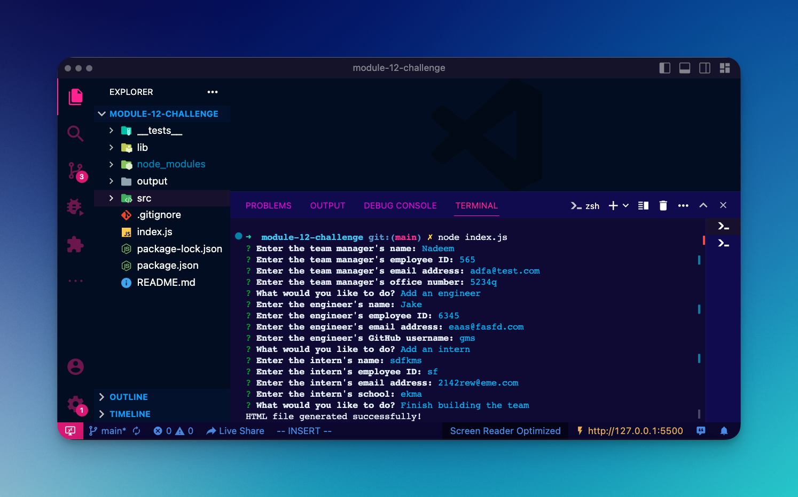
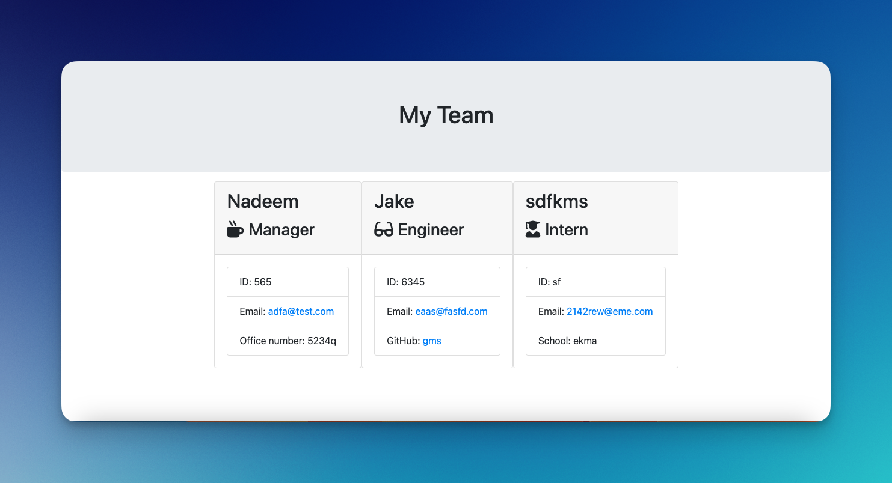

<!-- @format -->

# Module 12 Challenge - Team Profile Generator 

## Description

In this Challenge, I created an application that generates HTML files using input from a command-line interface.

## Table of Contents

-   [Screenshots](#screenshots)
-   [Installation](#installation)
-   [Usage](#usage)
-   [Contributing](#contributing)
-   [Tests](#tests)
-   [Questions](#questions)

## Screenshots

Terminal Application

Sample Output

## Installation

1. Download the repo as a .zip file.
2. Extract the contents.

## Usage

1.  Navigate to the extracted folder in your terminal.
2.  Run `npm install` to install the dependencies.
3.  Run `node index.js` to run the command line application in your terminal.

## Contributing

We are not accepting contributions at this time. Thanks for your interest.

## Tests

Run `npm test` to run tests using Jest.

## Questions

For any inquiries or issues, please contact through following channels:

GitHub Profile Link - [@nadeemamdev](https://github.com/nadeemamdev)

Email Address - nadeemamdev@gmail.com
